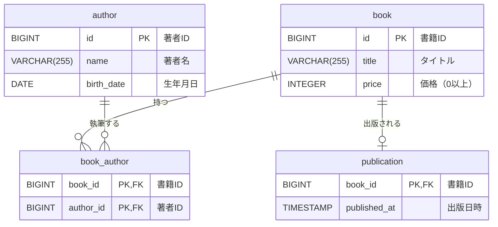

# DB構造

## テーブル一覧

| テーブル名 | 論理名 | 概要 |
|---|---|---|
| author | 著者 | 著者の基本情報を管理するテーブル |
| book | 書籍 | 書籍の基本情報を管理するテーブル |
| book_author | 書籍著者 | 書籍と著者の多対多関係を管理する中間テーブル |
| publication | 出版 | 書籍の出版イベントを管理するテーブル。レコードが存在する書籍を「出版済み」とみなす |

---

## テーブル定義

### author（著者）

| カラム名 | 型 | NULL | PK | 制約 | 説明 |
|---|---|---|---|---|---|
| id | BIGINT | NOT NULL | ✓ | AUTO INCREMENT | 著者ID |
| name | VARCHAR(255) | NOT NULL | | | 著者名 |
| birth_date | DATE | NOT NULL | | 現在日以前であること | 生年月日 |

---

### book（書籍）

| カラム名 | 型 | NULL | PK | 制約 | 説明 |
|---|---|---|---|---|---|
| id | BIGINT | NOT NULL | ✓ | AUTO INCREMENT | 書籍ID |
| title | VARCHAR(255) | NOT NULL | | | タイトル |
| price | INTEGER | NOT NULL | | 0以上であること | 価格 |

---

### publication（出版）

| カラム名 | 型 | NULL | PK | 制約 | 説明 |
|---|---|---|---|---|---|
| book_id | BIGINT | NOT NULL | ✓ | FK: book.id | 書籍ID |
| published_at | TIMESTAMP | NOT NULL | | | 出版日時 |

> 備考: このテーブルにレコードが存在する書籍を「出版済み」とみなす。出版済み書籍のレコードを削除（未出版に戻す）することはアプリケーション層で禁止する。

---

### book_author（書籍著者）

| カラム名 | 型 | NULL | PK | 制約 | 説明 |
|---|---|---|---|---|---|
| book_id | BIGINT | NOT NULL | ✓ | FK: book.id | 書籍ID |
| author_id | BIGINT | NOT NULL | ✓ | FK: author.id | 著者ID |

---

## リレーション

- `book` と `author` は多対多の関係（中間テーブル `book_author` を介して結合）
- 1冊の書籍は最低1人の著者を持つ
- 1人の著者は複数の書籍を執筆できる
- `book` と `publication` は1対0..1の関係（`publication.book_id` → `book.id`）。`publication` にレコードがある書籍が「出版済み」

---

## ER図

